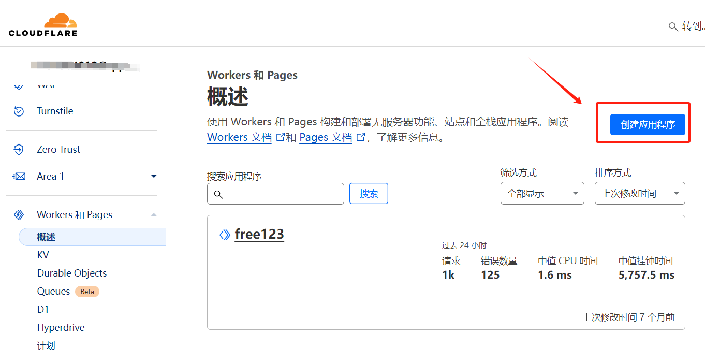
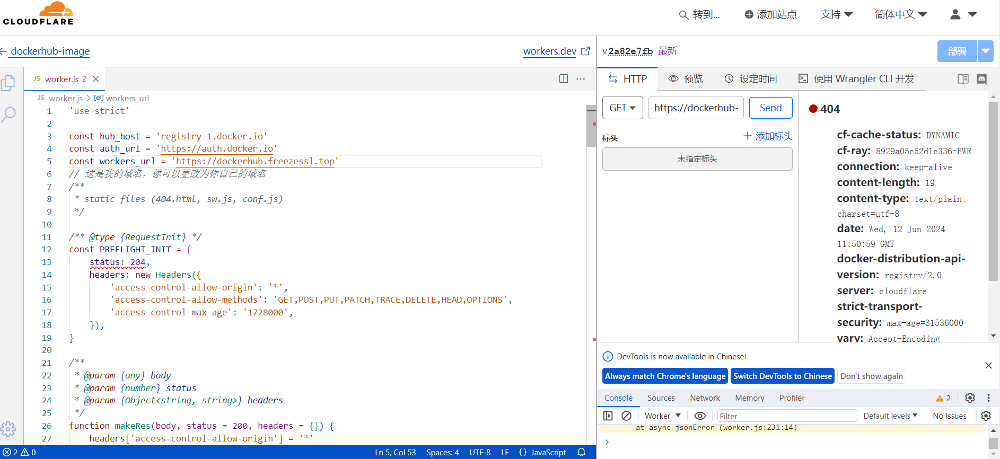

近期大陆彻底封锁了dockerhub的官方镜像地址，于是我查了查网上一些资料，决定自己部署一个个人自用镜像加速站，供自己的几个网络环境不是很好的大陆服务器拉取一些镜像。

本博客页面涉及技术仅供交流测试参考，请不要利用此技术去尝试一些违反中华人民共和国法律的操作。（dockerhub官源就是因为个别用户上传违法镜像被gfw封禁的）

自建 CloudFare DockerHub 镜像加速站站点：dockerhub.leezhu.cn


# 教程实践准备：
## 1.Cloudfare账号
解析到Cloudfare的域名（可选）

## 2.创建Cloudfare Workers



一直选下一步，选择编辑代码




```js
'use strict'

const hub_host = 'registry-1.docker.io'
const auth_url = 'https://auth.docker.io'
const workers_url = 'https://dockerhub.leezhu.cn'
// 这是我的域名，你可以更改为你自己的域名
/**
 * static files (404.html, sw.js, conf.js)
 */

/** @type {RequestInit} */
const PREFLIGHT_INIT = {
    status: 204,
    headers: new Headers({
        'access-control-allow-origin': '*',
        'access-control-allow-methods': 'GET,POST,PUT,PATCH,TRACE,DELETE,HEAD,OPTIONS',
        'access-control-max-age': '1728000',
    }),
}

/**
 * @param {any} body
 * @param {number} status
 * @param {Object<string, string>} headers
 */
function makeRes(body, status = 200, headers = {}) {
    headers['access-control-allow-origin'] = '*'
    return new Response(body, {status, headers})
}


/**
 * @param {string} urlStr
 */
function newUrl(urlStr) {
    try {
        return new URL(urlStr)
    } catch (err) {
        return null
    }
}


addEventListener('fetch', e => {
    const ret = fetchHandler(e)
        .catch(err => makeRes('cfworker error:\n' + err.stack, 502))
    e.respondWith(ret)
})


/**
 * @param {FetchEvent} e
 */
async function fetchHandler(e) {
  const getReqHeader = (key) => e.request.headers.get(key);

  let url = new URL(e.request.url);

    // 修改 pre head get 请求
    // 是否含有 %2F ，用于判断是否具有用户名与仓库名之间的连接符
    // 同时检查 %3A 的存在
    if (!/%2F/.test(url.search) && /%3A/.test(url.toString())) {
        let modifiedUrl = url.toString().replace(/%3A(?=.*?&)/, '%3Alibrary%2F');
        url = new URL(modifiedUrl);
        console.log(`handle_url: $ {
            url
        }`)
    }

  if (url.pathname === '/token') {
      let token_parameter = {
        headers: {
        'Host': 'auth.docker.io',
        'User-Agent': getReqHeader("User-Agent"),
        'Accept': getReqHeader("Accept"),
        'Accept-Language': getReqHeader("Accept-Language"),
        'Accept-Encoding': getReqHeader("Accept-Encoding"),
        'Connection': 'keep-alive',
        'Cache-Control': 'max-age=0'
        }
      };
      let token_url = auth_url + url.pathname + url.search
      return fetch(new Request(token_url, e.request), token_parameter)
  }

  url.hostname = hub_host;
  
  let parameter = {
    headers: {
      'Host': hub_host,
      'User-Agent': getReqHeader("User-Agent"),
      'Accept': getReqHeader("Accept"),
      'Accept-Language': getReqHeader("Accept-Language"),
      'Accept-Encoding': getReqHeader("Accept-Encoding"),
      'Connection': 'keep-alive',
      'Cache-Control': 'max-age=0'
    },
    cacheTtl: 3600
  };

  if (e.request.headers.has("Authorization")) {
    parameter.headers.Authorization = getReqHeader("Authorization");
  }

  let original_response = await fetch(new Request(url, e.request), parameter)
  let original_response_clone = original_response.clone();
  let original_text = original_response_clone.body;
  let response_headers = original_response.headers;
  let new_response_headers = new Headers(response_headers);
  let status = original_response.status;

  if (new_response_headers.get("Www-Authenticate")) {
    let auth = new_response_headers.get("Www-Authenticate");
    let re = new RegExp(auth_url, 'g');
    new_response_headers.set("Www-Authenticate", response_headers.get("Www-Authenticate").replace(re, workers_url));
  }

  if (new_response_headers.get("Location")) {
    return httpHandler(e.request, new_response_headers.get("Location"))
  }

  let response = new Response(original_text, {
            status,
            headers: new_response_headers
        })
  return response;
  
}


/**
 * @param {Request} req
 * @param {string} pathname
 */
function httpHandler(req, pathname) {
    const reqHdrRaw = req.headers

    // preflight
    if (req.method === 'OPTIONS' &&
        reqHdrRaw.has('access-control-request-headers')
    ) {
        return new Response(null, PREFLIGHT_INIT)
    }

    let rawLen = ''

    const reqHdrNew = new Headers(reqHdrRaw)

    const refer = reqHdrNew.get('referer')

    let urlStr = pathname
    
    const urlObj = newUrl(urlStr)

    /** @type {RequestInit} */
    const reqInit = {
        method: req.method,
        headers: reqHdrNew,
        redirect: 'follow',
        body: req.body
    }
    return proxy(urlObj, reqInit, rawLen, 0)
}


/**
 *
 * @param {URL} urlObj
 * @param {RequestInit} reqInit
 */
async function proxy(urlObj, reqInit, rawLen) {
    const res = await fetch(urlObj.href, reqInit)
    const resHdrOld = res.headers
    const resHdrNew = new Headers(resHdrOld)

    // verify
    if (rawLen) {
        const newLen = resHdrOld.get('content-length') || ''
        const badLen = (rawLen !== newLen)

        if (badLen) {
            return makeRes(res.body, 400, {
                '--error': `bad len: ${newLen}, except: ${rawLen}`,
                'access-control-expose-headers': '--error',
            })
        }
    }
    const status = res.status
    resHdrNew.set('access-control-expose-headers', '*')
    resHdrNew.set('access-control-allow-origin', '*')
    resHdrNew.set('Cache-Control', 'max-age=1500')
    
    resHdrNew.delete('content-security-policy')
    resHdrNew.delete('content-security-policy-report-only')
    resHdrNew.delete('clear-site-data')

    return new Response(res.body, {
        status,
        headers: resHdrNew
    })
}

```

将代码中的const workers_url = 'https://dockerhub.leezhu.cn' 更改为你自己的域名（可选），或者你可以查看此worker的网页链接域名进行更换，点击部署，就可以使用了。

## 3.设置docker镜像源

```shell
vim /etc/docker/daemon.json
```

```shell
{
  "registry-mirrors": ["https://<my-docker-mirror-host>"]
}
```

配置完成，重启docker

```shell
systemctl restart docker.service
```

测试： docker run hello-world，显示如下：

```shell
root@VM-16-5-debian:~/docker# docker run hello-world


Unable to find image 'hello-world:latest' locally
latest: Pulling from library/hello-world
c1ec31eb5944: Pull complete
Digest: sha256:266b191e926f65542fa8daaec01a192c4d292bff79426f47300a046e1bc576fd
Status: Downloaded newer image for hello-world:latest

Hello from Docker!
This message shows that your installation appears to be working correctly.

To generate this message, Docker took the following steps:
 1. The Docker client contacted the Docker daemon.
 2. The Docker daemon pulled the "hello-world" image from the Docker Hub.
    (amd64)
 3. The Docker daemon created a new container from that image which runs the
    executable that produces the output you are currently reading.
 4. The Docker daemon streamed that output to the Docker client, which sent it
    to your terminal.

To try something more ambitious, you can run an Ubuntu container with:
 $ docker run -it ubuntu bash

Share images, automate workflows, and more with a free Docker ID:
 https://hub.docker.com/

For more examples and ideas, visit:
 https://docs.docker.com/get-started/

```


## 4.docker安装离线教程 
https://blog.csdn.net/weixin_45881248/article/details/139636726?spm=1001.2014.3001.5502